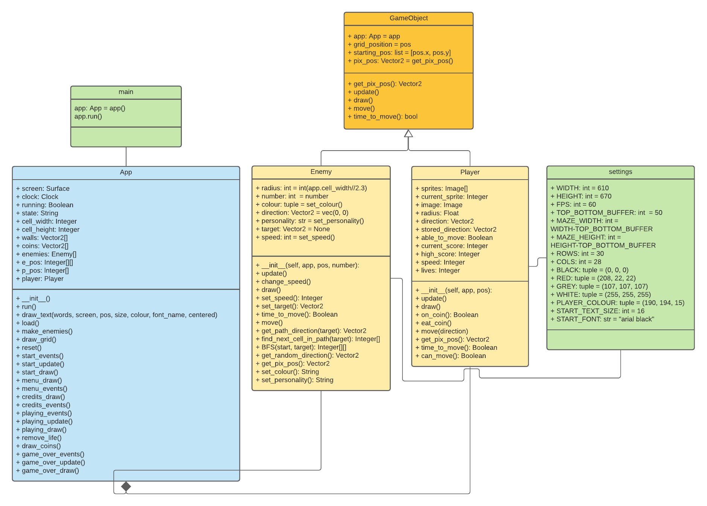

# lpc-atividade-final-packman

Leia: https://www.gamasutra.com/view/feature/3938/the_pacman_dossier.php?print=1


1) Modele o jogo do PACMAN de modo que ele respeite o SOLID
2) Implemente o PACMAN em PyGame e PEP* com a movimentação dos fantasmas o mais próximo que puder do original mostrado no dossier

Para entender o algoritmo de busca: https://www.youtube.com/watch?v=dQ42rha2qFA


Equipe: selecionada durante a aula

# Equipe

- Carlos Martins
- Dayvson Silva
- Elikson Tavares
- Fabio Ono
- Gustavo Fadel


# Diagrama
<div style="text-align:center"></div>


Link dos Sprites do game
http://labs.phaser.io/assets/games/pacman/


# Como executar 
```
pip install requirements.txt

python main.py
```
# Apresentação
https://user-images.githubusercontent.com/51340097/126236043-9a2d77f0-46b9-4579-930f-e488e7021fc4.mp4
